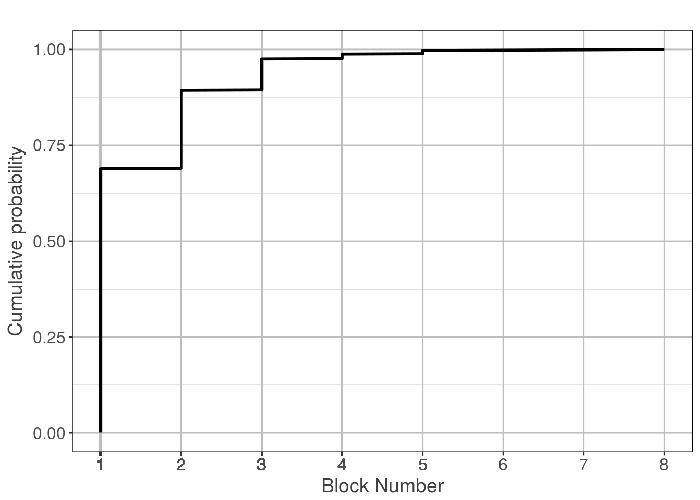
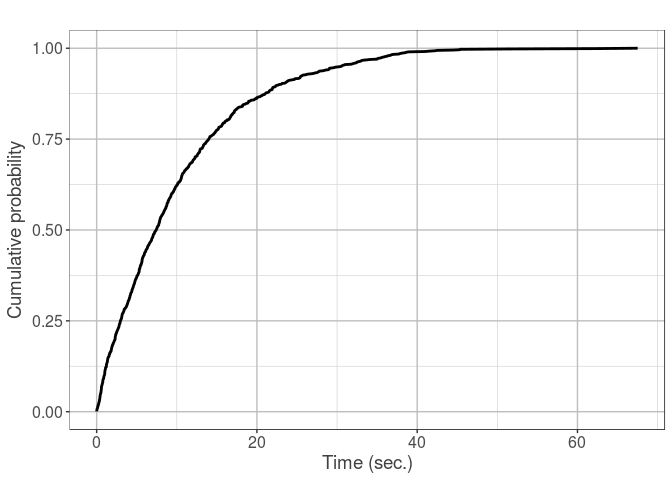
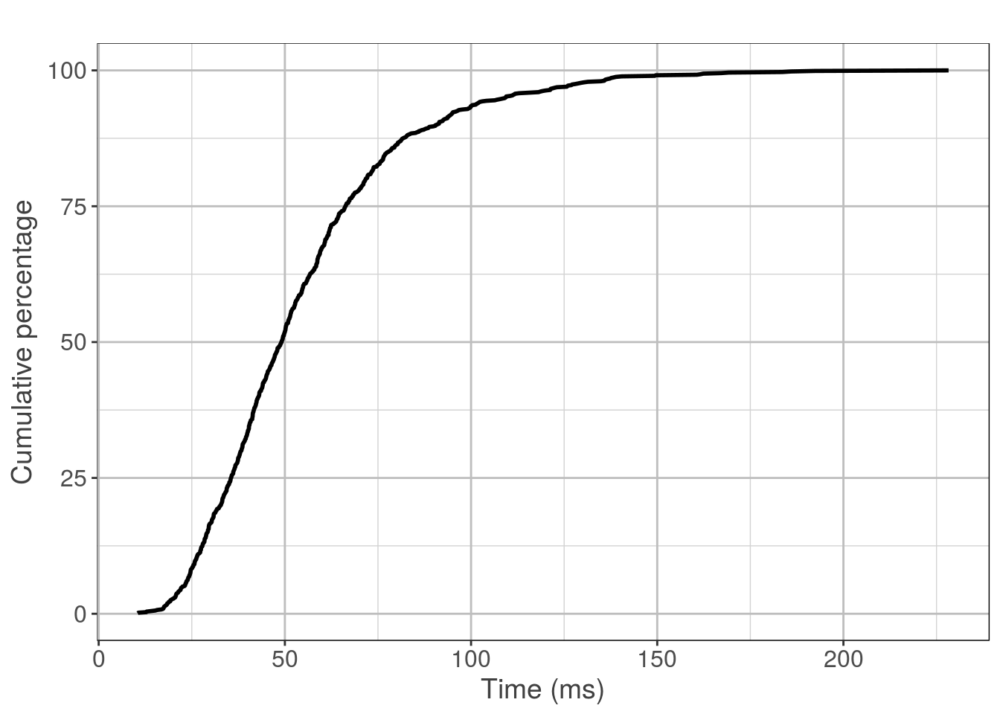
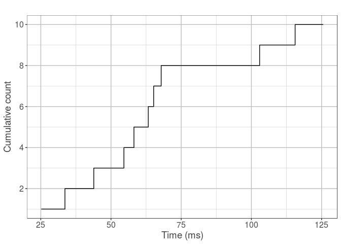

Plots for Hyperledger Blockchain Performance Metrics document
================
Harish Sukhwani (h (dot) sukhwani AT gmail (dot) com)
2018-09-10

Hyperledger's Performance and Scalability Working Group [PSWG](https://lists.hyperledger.org/g/perf-and-scale-wg) is working towards releasing a document on Performance Metrics. This file shows the R code for the plots generated in that document. The link to the document will be updated here when released.

Transaction Confirmation Probability
------------------------------------

### By block number

``` r
n <- 1000
m <- 10
#Assuming Geometric distribution for the block number in which a transaction is committed (+ 1)
x <- rgeom(n, 0.7) + 1
sorted_x <- sort(x)
ecdf_y <- (1:(n))/(n)
dataframe <- data.frame(sorted_x,ecdf_y)
ggplot(dataframe, aes(sorted_x,ecdf_y)) + geom_line(size=1) + scale_fill_grey() + theme(panel.grid.major = element_line(colour = 'grey'), panel.grid.minor = element_line(colour = 'light grey'), panel.background = element_rect(fill = 'white'), axis.title.x = element_text(size=legend_text_sizes, colour = 'grey25'), axis.title.y = element_text(size=legend_text_sizes, colour = 'grey25'), legend.text = element_text(size=text_sizes), axis.text.x = element_text(size=text_sizes), axis.text.y = element_text(size=text_sizes), legend.position="top", panel.border = element_rect(colour = "black", fill=NA, size=0.25)) + xlab("Block Number") + ylab("Cumulative probability") + scale_x_continuous(breaks = dataframe$sorted_x, minor_breaks = NULL) + ggtitle("")
```



### By time

``` r
x_exp <- rexp(1000, 0.1)
ecdf_plot <- ecdf(x_exp)
x_exp_cdf <- ecdf_plot(unique(x_exp))
dataframe <- data.frame(x_exp,x_exp_cdf)
ggplot(dataframe, aes(x_exp,x_exp_cdf)) + geom_line(size=1) + scale_fill_grey() + theme(panel.grid.major = element_line(colour = 'grey'), panel.grid.minor = element_line(colour = 'light grey'), panel.background = element_rect(fill = 'white'), axis.title.x = element_text(size=legend_text_sizes, colour = 'grey25'), axis.title.y = element_text(size=legend_text_sizes, colour = 'grey25'), legend.text = element_text(size=text_sizes), axis.text.x = element_text(size=text_sizes), axis.text.y = element_text(size=text_sizes), legend.position="top", panel.border = element_rect(colour = "black", fill=NA, size=0.25)) + xlab("Time (sec.)") + ylab("Cumulative probability") + ggtitle("")
```



Block transmission time
-----------------------

### Large network

Let us assume block transmission time is LogNormally distributed. For this plot, I assume mean time is around 50 sec. and sd around 25ms (around 1/2 of mean). Thus the meanlog parameter is log(50) and sdlog parameter is log(50)/8.

``` r
rlnorm_dataset = rlnorm(1000,log(50),log(50)/8)
ecdf_rlnorm = ecdf(rlnorm_dataset)
rlnorm_cdf = ecdf_rlnorm(unique(rlnorm_dataset))*100
dataframe = data.frame(x=rlnorm_dataset, y=rlnorm_cdf)
#plot(ecdf(),xlab="time", ylab="Cumulative % of nodes", main="")
ggplot(dataframe, aes(x,y)) + geom_line(size=1) + scale_fill_grey() + theme(panel.grid.major = element_line(colour = 'grey'), panel.grid.minor = element_line(colour = 'light grey'), panel.background = element_rect(fill = 'white'), axis.title.x = element_text(size=legend_text_sizes, colour = 'grey25'), axis.title.y = element_text(size=legend_text_sizes, colour = 'grey25'), legend.text = element_text(size=text_sizes), axis.text.x = element_text(size=text_sizes), axis.text.y = element_text(size=text_sizes), legend.position="top", panel.border = element_rect(colour = "black", fill=NA, size=0.25)) + xlab("Time (ms)") + ylab("Cumulative percentage") + ggtitle("")
```



### Small network

``` r
rlnorm_dataset = rlnorm(10,log(50),log(50)/8)
x = sort(rlnorm_dataset)
y = rank(x)
#Just to make plot prettier
x = c(x, x[length(x)] + 10) 
y = c(y, y[length(y)]) 
dataframe = data.frame(x,y)
ggplot(dataframe, aes(x,y)) + geom_step() + scale_fill_grey() + scale_y_continuous(breaks=c(2,4,6,8,10)) + theme(panel.grid.major = element_line(colour = 'grey'), panel.grid.minor = element_line(colour = 'light grey'), panel.background = element_rect(fill = 'white'), axis.title.x = element_text(size=legend_text_sizes, colour = 'grey25'), axis.title.y = element_text(size=legend_text_sizes, colour = 'grey25'), legend.text = element_text(size=text_sizes), axis.text.x = element_text(size=text_sizes), axis.text.y = element_text(size=text_sizes), legend.position="top", panel.border = element_rect(colour = "black", fill=NA, size=0.25)) + xlab("Time (ms)") + ylab("Cumulative count") + ggtitle("")
```


